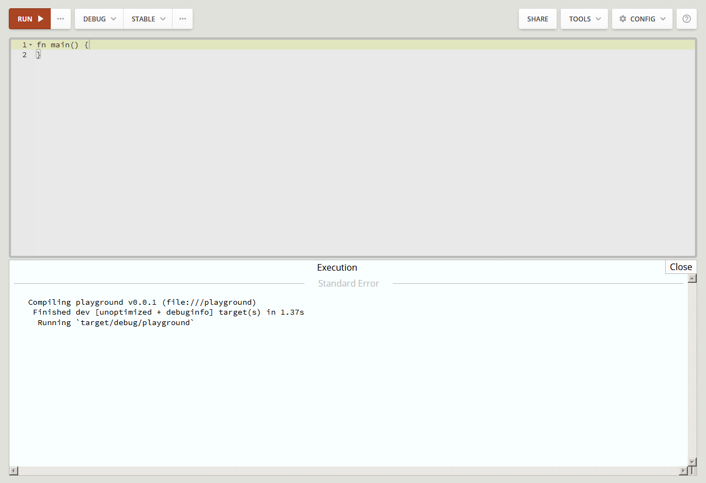

## Привет, Rust!

Простейшая программа выглядит следующим образом:
```rust
fn main() {
}
```

Эта программа не делает ничего - просто работает. Обратите внимание, что мы написали.
Это функция с именем 'main". Под функцией понимается набор инструкций, которые
что-либо делают и этот набор имеет имя.

Разберём синтаксис. "fn" - это сокращение от английского слова "function" - функция.
Далее пишем имя "main". Круглые скобки обозначают блок, который может содержать
входные параметры функции. Далее следует блок фигурных скобок, в котором могут
находиться операторы и выражения.

Функция "main" является главной функцией. Именно её содержимое выполняется при
запуске программы.

Для проверки работы программы вам не понадобиться ничего устанавливать на компьютер.
Достаточно перейти на страничку [play.rust-lang.org](https://play.rust-lang.org/),
втавить в поле ввода код программы и нажать кнопку "Run". Результат работы программы
будет отображён в нижней части экрана.
[](https://play.rust-lang.org/)

Итак, напишем программу, которая печатает в терминальную строку текст.
```rust
fn main() {
    println!("Привет, Rust!");
}

```

Перейдя по [ссылке](https://play.rust-lang.org/?gist=d474c62fd4b9ef2a700b3a104398aeda&version=stable&mode=debug&edition=2015),
вы перейдёте в среду разработки *Rust Playground* и, нажав кнопку "Run",
сможете посмотреть, на результат работы программы.

А теперь разберём синкаксис этот программы шаг за шагом, символ за символом:
- `println` - это имя макроса стандартной библиотеки Rust.
- `!` - это символ-индикатор, сообщающий о том, что предшествующее имя является макросом. Без этого символа слово `print` будет обозначать имя функции. Такой функции нет в стандартной библиотеки и чтобы в этом убедиться достаточно удалить этот символ и снова выполнить программу. Будет ошибка, описание которой сообщит, что такой функции нет. Кроме того из описания вы можете узнать, как эту ошибку исправить.
- `(` - это символ-индикатор начала списка аргументов макроса.
- `"` - это символ-индикатор начала текстовых данных.
- `Привет, Rust!` - это содержание текстовых данных.
- `"` - это символ-индикатор конца текстовых данных.
- `)` - это символ-индикатор конца списка аргументов макроса.
- `;` - это символ-индикатор конца оператора.

Язык Rust различает символы верхнего и нижниго регистра и, поэтому, например,
имена функций: println, printlN, printLn, prinTln, priNtln, prIntln, pRintln, Println
будут именами различных функций. Запустите эту программу в среде разработке и,
следуя указаниям текстовых сообщений компилятора, вы ещё многое узнаете о хорошем
стиле Rust-программирования
```
fn println() {
    println!("println");
}
fn printlN() {
    println!("printlN");
}
fn printLn() {
    println!("printLn");
}
fn prinTln() {
    println!("prinTln");
}
fn priNtln() {
    println!("priNtln");
}
fn prIntln() {
    println!("prIntln!");
}
fn pRintln() {
    println!("pRintln");
}
fn Println() {
    println!("Println");
}
fn main() {
    println();
    printlN();
    printLn();
    prinTln();
    priNtln();
    prIntln();
    pRintln();
    Println();
}

```
(Run in Rust Playground)[https://play.rust-lang.org/?gist=d5688a5c9cf58205dd405e54628e012a&version=stable&mode=debug&edition=2015]
